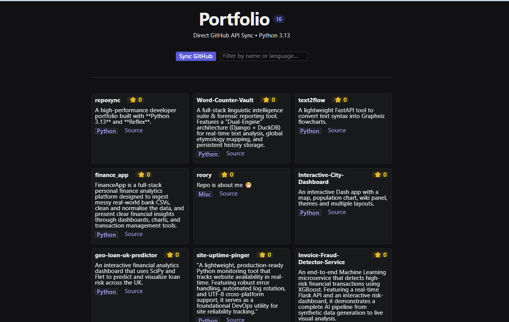

# 🌌 Reposync | The Reactive Portfolio


---

**ReopSync** is a high-performance, real-time developer portfolio that synchronizes directly with the GitHub API. Built entirely in Python using the Reflex framework, it eliminates the need for manual updates or complex JavaScript configurations.

---

## 📸 Screenshots


---

## 🚀 Reflex + Python 3.13?

In 2026, the "JavaScript Fatigue" is real. I chose this stack for three specific reasons:

1. **Pure Python:** No context-switching between frontend (JS) and backend (Python). One language, one logic, one codebase. 😁
2. **True Reactivity:** Using Reflex's `State` and `@rx.var` decorators, the UI updates instantly without manual DOM manipulation.
3. **Python 3.13 Performance:** Leveraging the latest improvements in the Python interpreter for faster API handling and concurrent requests.

---

## 🛠️ Features

- **Live Sync**: One-click synchronization with the GitHub REST API.
- **Intelligent Filtering**: Real-time search by project name or primary language.
- **Dynamic Counters**: Automatic project counting via Computed Vars.
- **Themed UI**: Built-in dark mode with the 'Iris' accent system.

---

## ⚡Quick Start

### 1. Prerequisites
Ensure you have **Python 3.13 or above** installed.

### 2. Installation
```
# Clone the repository
git clone [https://github.com/reory/reposync.git](https://github.com/YOUR_USERNAME/reposync.git)
cd reposync
```
### Setup environment
```bash
python -m venv venv
.\venv\Scripts\activate  # Windows
```
### Install dependencies
```bash
pip install -r requirements.txt
```
### Execution
```
Powershell
reflex init
reflex run
```

---

# 📝 Configuration
To view your own projects, simply change the github_username in reposync.py:
```
Python
class State(rx.State):
    github_username: str = "YOUR_GITHUB_NAME"
```

---

# 🛣️ Roadmap Features

- [ ] GitHub Actions: Set up an automation that "pings" your website every time you push code to GitHub so it's always fresh.

- [ ] Analytics Dashboard: Build a private "Admin" tab that shows how many people have clicked "Source" buttons.

- [ ] [ ] Language Icons: Use rx.cond to show the actual logo (Python, JS, C++) next to the language badge.

- [ ] Caching: Save the GitHub data to a local SQLite database so the page loads instantly even before the user hits "Sync."

* **Built by Roy Peters**
